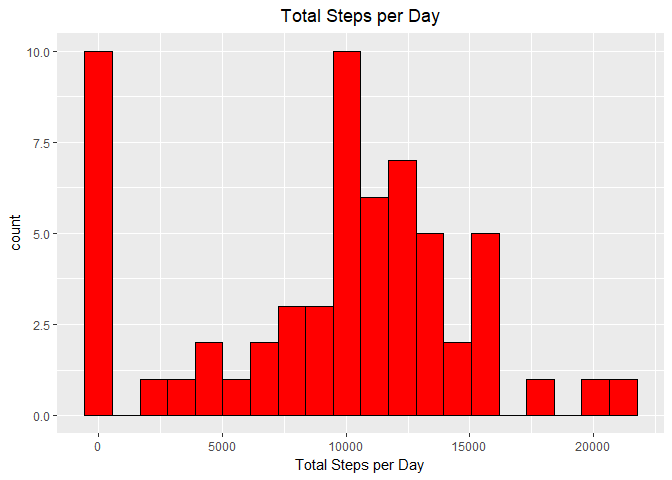
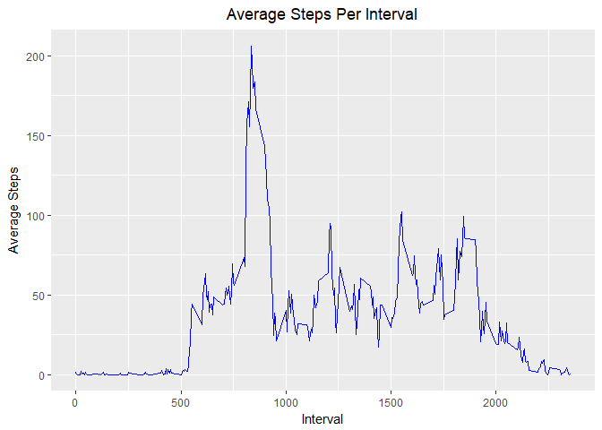
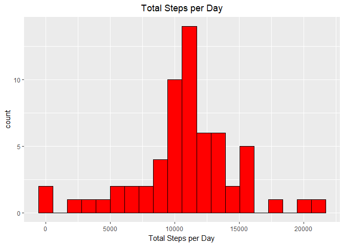
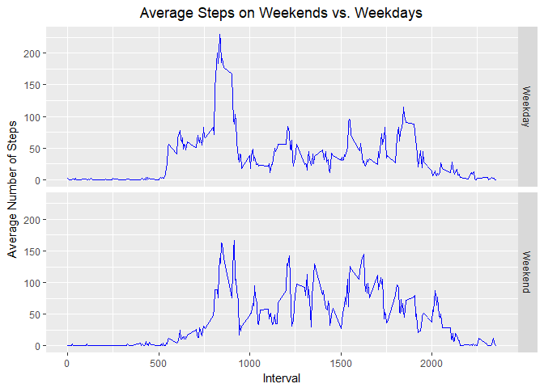

### Loading Packages and Reading Data

The following code loads the data table package and the ggplot2 package which are required for the analysis.

```r
require(data.table)
require(ggplot2)
activity<-fread("activity.csv",key = "interval")
activity[,date:=as.Date(date,"%Y-%m-%d")]
knitr::kable(summary(activity))
```

         steps             date               interval    
---  ---------------  -------------------  ---------------
     Min.   :  0.00   Min.   :2012-10-01   Min.   :   0.0 
     1st Qu.:  0.00   1st Qu.:2012-10-16   1st Qu.: 588.8 
     Median :  0.00   Median :2012-10-31   Median :1177.5 
     Mean   : 37.38   Mean   :2012-10-31   Mean   :1177.5 
     3rd Qu.: 12.00   3rd Qu.:2012-11-15   3rd Qu.:1766.2 
     Max.   :806.00   Max.   :2012-11-30   Max.   :2355.0 
     NA's   :2304     NA                   NA             

### Total Number of Steps
Lets examine the total daily steps the subject takes each day.


```r
totalSteps<-activity[,.(total.steps = sum(steps,na.rm = T)),by = date]
a<- ggplot(totalSteps)+
    theme(plot.title = element_text(hjust = 0.5))
a+geom_histogram(aes(total.steps),fill = 'red',colour = 'black',bins = 20)+
    ggtitle("Total Steps per Day")+
    xlab("Total Steps per Day")
```

<!-- -->
  
As seen the most common number of steps per day is 0. This is due to a number of days having only missing values which will be addressed in a subsequent section. 

On average the subject takes 9354 steps per day and the on the median day takes 10395 steps.

### Average Day

Next we will exam the subject's average day.  to do this we will create a graph of how meny steps the subject takes in each 5 minute interval.

```r
 averageSteps<- activity[,.(average.steps = mean(steps,na.rm = T)), by = interval]
b<- ggplot(averageSteps)+
    theme(plot.title = element_text(hjust = 0.5))
b+geom_line(aes(interval,average.steps), colour = 'blue')+
    ggtitle("Average Steps Per Interval")+
    ylab("Average Steps")+
    xlab("Interval")
```

<!-- -->

As seen in the Graph above the subject is sedentary in the mornings until around interval 500, and the subject takes them most average steps on interval 835.

### Missing Values

Now we will address the 2304 missing values by imputing the average number of steps taking during the same interval on all days were the value is not missing.

```r
setkey(averageSteps,interval)

activity[averageSteps, steps := ifelse(is.na(steps)
                                       ,as.integer(round(average.steps,0))
                                       ,steps)]

totalStepsm<-activity[,.(total.steps = sum(steps,na.rm = T)),by = date]
a<- ggplot(totalStepsm)+
    theme(plot.title = element_text(hjust = 0.5))
a+geom_histogram(aes(total.steps),fill = 'red',colour = 'black',bins = 20)+
    ggtitle("Total Steps per Day")+
    xlab("Total Steps per Day")
```

<!-- -->

As expected the new distribution as shifted to the right since we added steps were there used to be missing values.  The new average is 10766 which is 1412  higher then it was when we omited the missing values.  The new median is 10762 which is 367  higher then it was when we omited the missing values. The without the missing values the distrubition is closer to a normal distribution.     

### Weekends vs Weekdays

Finally we will examine how the sujbect's weekdays differ from thier weekends.


```r
activity[,Day :=as.factor(ifelse(grepl("^S",weekdays(date))
                           ,"Weekend"
                           ,"Weekday"))]

averageSteps<- activity[,.(average.steps = mean(steps,na.rm = T))
                        , by = list(interval,Day)]
b<- ggplot(averageSteps)+
    theme(plot.title = element_text(hjust = 0.5))
b+geom_line(aes(interval,average.steps), colour = 'blue')+
    facet_grid(Day~.)+
    xlab("Interval")+
    ylab("Average Number of Steps")+
    ggtitle("Average Steps on Weekends vs. Weekdays")
```

<!-- -->
  
The subject takes longer to become active on weekends, however they take more steps in most intervals.
